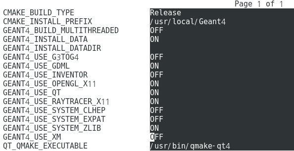

How to run MimosaSimu 
=====================

There are two options to use MimosaSimu.  

## Lxplus
Run in Lxplus machine. To set up environment, type this: 
<blockquote>

 source Mimosa-lxplus-setup.sh

</blockquote>

## Private machine
To run in your own machine. You have to install pre-requisite libraries and programs. 
<li> Xerces-C(libxerces-c), qt, qt-devel, qt3, libXi, libGL </li>
<li> CLHEP > 2.1.x.x, cmake > 3.9.0(Necessary!), ROOT 5.34(Not available with ROOT 6) </li>
<li> Install Geant4 (4.9.x or 4.10.x) </li> 

<li> </li>
